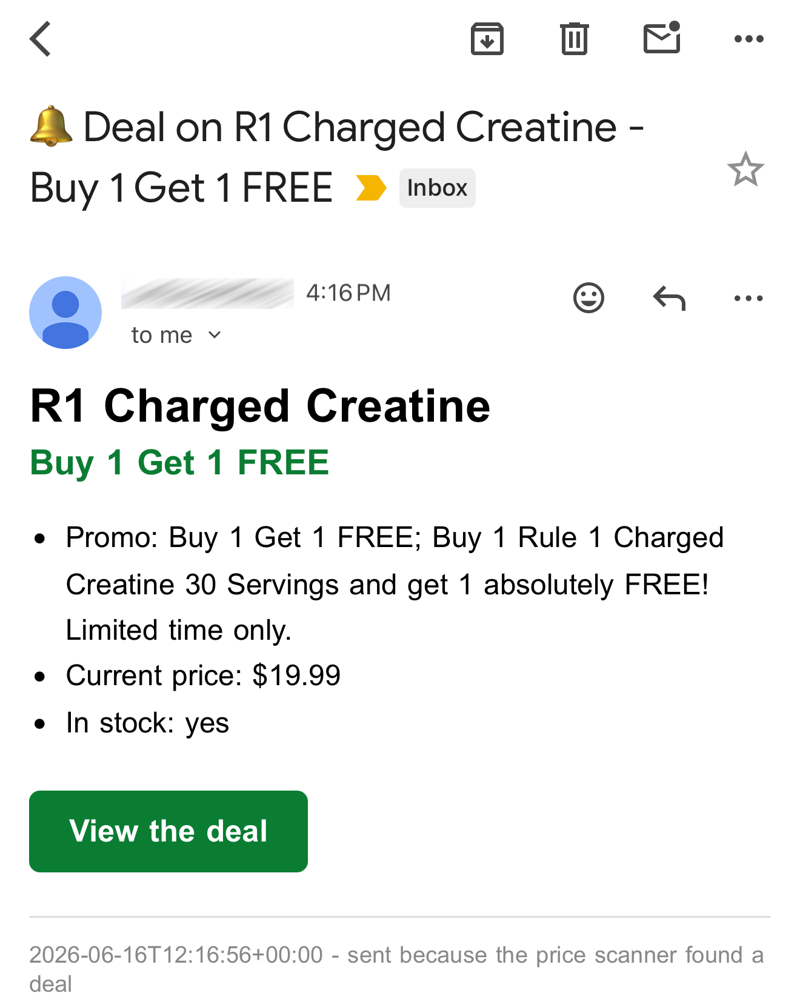

# SaleScanner

A serverless price and promotion scanner that checks a retail product page once a day and emails me the moment it goes on sale or runs a Buy 1 Get 1 Free deal, with a direct link to the product.

## What it looks like

## Why I built it
I wanted to be alerted the instant a specific product dropped in price or hit a BOGO offer without manually checking the site every day. It began as a simple "notify me on a sale" idea and grew into a small but complete piece of automation: fetching past bot protection, parsing, scheduling, deduplication and transactional email, all running on free tiers.

## How it works
- A daily GitHub Actions job fetches the product page through a scraping API, since the site blocks direct requests.
- A parser reads the price and promotion state from the page itself. BOGO deals are detected from the badge text, because a Buy 1 Get 1 offer never changes the listed price.
- The current deal "signature" is compared against the last one stored in the repo. If it is new or changed, an alert email goes out. Otherwise the run stays silent, so the same deal is never reported twice.
- State persists by committing a small JSON file back to the repo after each run, so there is no database or server to maintain.
- If the fetch fails several runs in a row, a email flags it, so a silent breakage never hides a real deal.

## Tech stack
- Python (requests, BeautifulSoup)
- ScraperAPI for fetching past bot detection
- Resend for transactional email
- GitHub Actions for serverless daily scheduling and state persistence
- pytest for parser, decision-logic and block-detection tests

## Cost
Runs entirely on free tiers. One request per day sits well inside the scraping API's free package and there is no server or database, so the whole thing costs nothing to operate.
